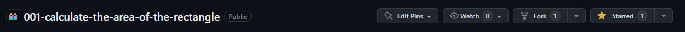

# Activities

## 1. Daily Coding Challenges

### How to join?

1. Star the certain repository, it will serve as you're participating in the challenge.



2. Clone the repository to your local machine.

```bash
git clone https://github.com/organization_name/repo_name.git
```

3. Create a new branch with your name.

```bash
git checkout -b your_name
```

4. Create a new folder with your name.

```bash
mkdir your_name
```

5. Create a new file with the name of the challenge.

```bash
touch your_name/challenge_name
```

6. Add your name to the file.

```bash
echo "Your Name" >> your_name/challenge_name
```

7. Commit your change, add a message, and co-author the commit with "noeyislearning".

```bash
git add . && git commit -m "Add my name to the challenge" -m "Co-authored-by: noeyislearning <hello@noeyislearning.dev>"
```
